# Rust

Rust is for people who crave speed and stability in a language. By speed, we mean both how quickly Rust code can run and the speed at which Rust lets you write programs. The Rust compiler’s checks ensure stability through feature additions and refactoring. This is in contrast to the brittle legacy code in languages without these checks, which developers are often afraid to modify. By striving for zero-cost abstractions—higher-level features that compile to lower-level code as fast as code written manually—Rust endeavors to make safe code be fast code as well.

# Rust Cargo Reference

## 1. Getting Started

Cargo is the Rust package manager that helps developers build, test, and manage dependencies. Instead of using `rustc`, Cargo simplifies the process with commands like `cargo build`.

### What Cargo Does:

- Downloads dependencies (known as **crates**) from a central repository.
- Compiles Rust packages.
- Creates distributable packages.
- Optionally uploads them to **crates.io**, Rust’s package registry.
- Fetches dependencies from a registry and integrates them into the build process.

## 2. Cargo Guide

### Project Structure

A typical Cargo project includes:

- **Cargo.toml** – Describes dependencies (managed by the development team).
- **Cargo.lock** – Locks exact dependency versions for reproducibility (auto-generated).
- **src/** – Contains source code.
    - `src/lib.rs` – Default library file.
    - `src/main.rs` – Default executable file.
    - `src/bin/` – Additional executables.
- **benches/** – Contains benchmark tests.
- **examples/** – Stores example programs.
- **tests/** – Contains integration tests.

### Dependency Management

Cargo fetches dependencies from **crates.io** or directly from a **Git repository**:

Example `Cargo.toml`:

```toml
[[package]]
name = "hello_world"
version = "0.1.0"
dependencies = [
  "regex 1.5.0 (git+https://github.com/rust-lang/regex.git#9f9f693768c584971a4d53bc3c586c33ed3a6831)"
]
```

### How Git Dependencies Work

When fetching dependencies from GitHub instead of crates.io, Cargo follows these steps:

1. Clones the repository into a local cache (`~/.cargo/git/`).
2. Checks out the specified commit, locking it to an exact state.
3. Builds the dependency from the checked-out commit.
4. Records this information in `Cargo.lock` for reproducible builds.

## 3. Running Tests

To run tests, use: ```cargo test```. Cargo will look for tests in the `src/` directory or any `tests/` directory.

## 4. Key Concepts

- **Packages** – A Cargo feature that lets you build, test, and share crates.
- **Crates** – A tree of modules that produces a library or executable.
- **Modules & use** – Controls the organization, scope, and privacy of paths.
- **Paths** – Names used for structs, functions, or modules.

## 5. Cargo for Web Backends

Cargo can support Rust as a backend for a web app, which typically involves:

- Running an HTTP server to handle JSON requests/responses.
- Connecting to a PostgreSQL database.
- Managing dependencies for web frameworks, database clients, and other utilities.

Cargo simplifies dependency management and build processes, making Rust a viable choice for backend development.

You compile a rust program using `rustc <filename.rs`. This is similar to running `gcc or clang`  for C++. Rust is a ahead-of-time compiled language, meaning you can compile a program and give the executable to someone else, and they can run it without having rust installed. If you give someone a `*.rb, *.py or *.js` file they need to have Ruby, Python, or JavaScript implementation installed. In those languages you only need one command to compile and run your program. The `rustc` generates a binary executable. 

Breaking the Cargo.toml down:

[package]
name = "hello_cargo"
version = "0.1.0"
edition = "2024"

[dependencies]

The first line, `[package]`, is a section heading that indicates that the following statements are configuring a package. As we add more information to this file, we’ll add other sections.

The next three lines set the configuration information Cargo needs to compile your program: the name, the version, and the edition of Rust to use. The last line, `[dependencies]`, is the start of a section for you to list any of your project’s dependencies. In Rust, packages of code are referred to as *crates*. 

Running `cargo build` for the first time also causes Cargo to create a new file at the top level: *Cargo.lock*. This file keeps track of the exact versions of dependencies in your project. This project doesn’t have dependencies, so the file is a bit sparse. You won’t ever need to change this file manually; Cargo manages its contents for you.

Cargo also provides a command called `cargo check`. This command quickly checks your code to make sure it compiles but doesn’t produce an executable.

You can use **cargo run to compile and execute and cargo check if you want to check for compilation errors.** Cargo can tell if you code has changed or not, so if you re-run either command and nothing happens, it means that the code has not changed since the last execution. 

- We can create a project using `cargo new`.
- We can build a project using `cargo build`.
- We can build and run a project in one step using `cargo run`.
- We can build a project without producing a binary to check for errors using `cargo check`.
- Instead of saving the result of the build in the same directory as our code, Cargo stores it in the *target/debug* directory

When your project is finally ready for release, you can use `cargo build --release` to compile it with optimizations. This command will create an executable in *target/release* instead of *target/debug*. The optimizations make your Rust code run faster, but turning them on lengthens the time it takes for your program to compile. This is why there are two different profiles: one for development, when you want to rebuild quickly and often, and another for building the final program you’ll give to a user that won’t be rebuilt repeatedly and that will run as fast as possible. If you’re benchmarking your code’s running time, be sure to run `cargo build --release` and benchmark with the executable in *target/release*.

In rust, variables are immutable by default meaning once we give the variable a value, the value won’t change. To make a variable mutable we add the prefix `mut`. 

```jsx
let apples = 5; // immutable 
let mut apples = 5; // mutable
```

The `&` indicates that this argument is a reference, which gives you a way to let multiple parts of your code access one piece of data without needing to copy that data into memory multiple times. References are a complex feature, but Rust has made it easy and safe to use. References are immutable by default. 

A crate is a collection of Rust source code files. Projects can be a binary crate which is an executable or a library crate, which contains code that is intended to be used in other programs and cannot be executed on its own. 

Cargo’s coordination of external crates is where Cargo really shines. 

When you add new entries to the `[dependencies]` in the Cargo.toml file, Cargo fetches the latest versions of everything that dependency needs from the registry, which is a copy of data from [Crates.io](http://Crates.io). The Crates.io is where people in the rust ecosystem post their open source rust projects for others to use. 

After updating the registry, Cargo checks the `[dependencies]` section and downloads any crates listed that aren’t already downloaded. Cargo will also grab other crates that `dependency A` depends on to work. After downloading the crates, rust compiles them and then compiles the project with the dependencies available. 

Cargo has a mechanism that ensure you can rebuild the same artifact every time you or anyone else builds your code. Cargo will use only versions of the dependencies you specified until you indicate otherwise. When you build a project for the first time, Cargo figures out all the versions of the dependencies that fit the criteria and then writes them to the Cargo.ock file. 

When you build your project in the future, Cargo will see that the Cargo.lock file exists and will use the versions specified there rather than doing all the work of figuring out versions again. This lets you have reproducibles builds automatically. In other words, your project will use `dependency 0.8.5` unless you **explicitly upgrade it in the Cargo.toml** file. The **Cargo.lock is important for reproducible builds, therefore it should be checked into source control with the rest of the code in your project.** 

`const` can be used in the global scope and `let` can only be used in a function. 

Signed integers vs unsigned integers. 

- signed integers are stored using two’s complement and includes positive and negative numbers.
- unsigned integers are positive and only positive.

Rust gracefully handles integer overflow by applying two’s complement wrapping. In short, values greater than the maximum value the type can hold “wrap around” to the minimum of the values the type can hold. In the case of u8, the value 256 becomes 0, the value 257 becomes 1 and so on… 

Arrays and Tuples have a fixed length in Rust. This is different from the other programming languages. 
Data is allocated in a stack for arrays. Data is allocated in a heap for vectors. 

```jsx
fn five() -> i32 {
    5
}

fn main() {
    let x = five();

    println!("The value of x is: {x}");
}
```

In rust they call it expressions, and the return value does not a semi-colon. In rust, nearly everything is an expression (e.g even `if, match` blocks), and the value of an expression can be returned directly. If you end a line without a semi-colon, rust treats it as an expression whose value is returned. 

If you add a semi-colon, it turns the expression into a statement, which means it produces `()` (the unit type) instead of returning a value. In rust, a curly-brace block like `{/* ... */}` is an expression and syntactic scope. 

```jsx

fn f(x: i32) -> i32 { x + 1 }
fn main() {
  println!("{}", f({
    let y = 1;
    y + 1
  }));
}
// This compiles and would would return 3. 
```

Rust conditionals must be explicit. They do not do implied booleans (`if variable == None` or `if 0`. You need to be explicit at all times in rust. 

Ownership is a unique feature in Rust. It enables Rust to make memory safe guarantees without needing a garbage collector, so it’s important to understand how ownership works. 

In embedded programming, we want our compiled code to be as tiny as possible, so this mode makes it easier to ensure our program only includes the bare minimums. 

[https://rybicki.io/blog/2024/04/16/program-arduino-using-rust.html](https://rybicki.io/blog/2024/04/16/program-arduino-using-rust.html) : **How to program an Arduino using Rust (on macOS)**

[https://docs.rust-embedded.org/book/](https://docs.rust-embedded.org/book/) : **Embedded programming book** 

A foundational goal of rust is to ensure that your programs never have undefined behavior. That is the meaning of “safety”. Undefined behavior is especially dangerous for low-level programs with direct access to memory. 

Another goal is precent undefined behavior at compile-time instead of run time. 
- Catch bugs at compile-time means avoiding those bugs in production, improving the reliability of your software.
- Catch bugs at compile-time means fewer runtime checks for those bugs.

Memory is an array of bytes or is the pointers I get back from running `malloc` 

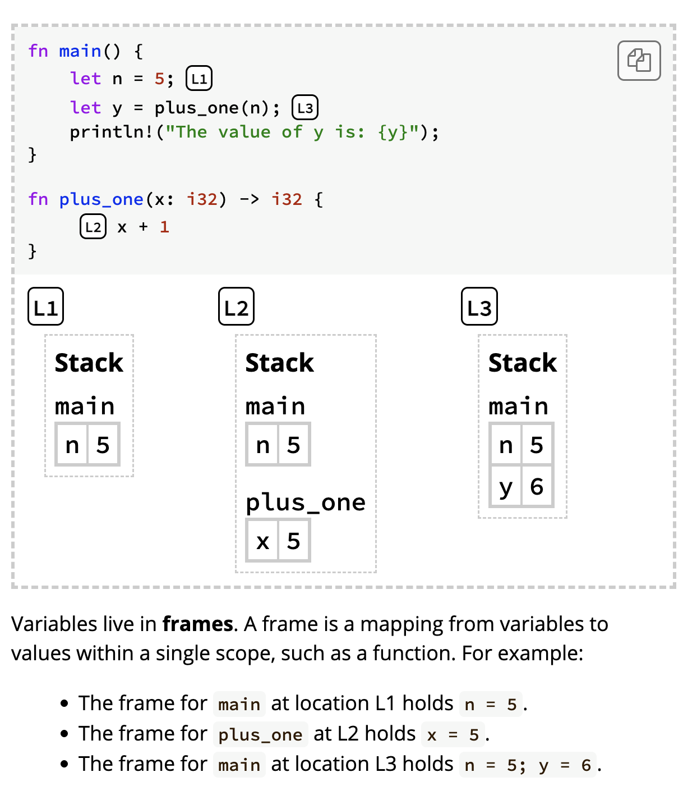

**A pointer is a value that describes a location in memory. The value that the pointer points-to is called its pointee. One common way to make a pointer is to allocate memory in the heap. The heap is a separate region of memory where data can live indefinately. Heap data is not tied to a specific stack frame. Rust uses a construct called a Box  for putting elements onto a heap.** 

The difference between a stack and the heap. The stack holds data associated with a specific function, while the heap holds data that can outlive a function.  Frames in the stack are associated with a specific function, and are deallocated when the function returns. Data on the heap can live indefinitely. Note that both stack and heap data can be mutable and can be copyable. The heap is allowed to contain pointers (even to the stack, as we will see later).

Stack frames are automatically handled by Rust. Rust will allocate and deallocate stack frames as the program executes. Rust does not allow programs to manually deallocate memory.

**Ownership**

```jsx
let a = Box::new([0, 1_000_000]); 
let b = a 
```

When `a` is bound to `Box::new([0; 1_000_000])`, we say that `a` **owns** the box. The statement `let b = a` **moves** ownership of the box from `a` to `b`.

**Box deallocation principle:** If a variable owns a box, when Rust deallocates the variable’s frame, then Rust deallocates the box’s heap memory.

This code would not compile 

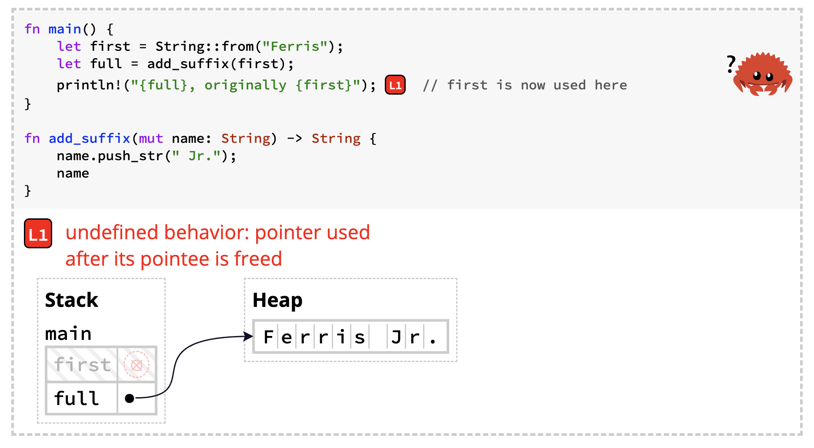

`first` points to deallocated memory after calling `add_suffix`. Reading `first` in `println!` would therefore be a violation of memory safety (undefined behavior). Remember: it’s not a problem that `first` points to deallocated memory. It’s a problem that we tried to *use* `first` after it became invalid.

The **moved heap data principle: if a variable x moves ownership of heap data to another variable y then x cannot be used after the move.** 

Moving ownership of heap data avoids undefined behavior from reading deallocated memory.

One way to avoid moving data is to use the method `clone()` which will create a new entry in the heap that can be safely modified. This allows you to continue to use the variable that was referenced to create the clone. 

Rust’s ahead of time static analysis

- does not trust runtime values like `b == false`
- it assumes both branches of an `if` could execute
- if one branch might move/consume a value, then after the `if` that value is considered potentially invalid.

This is what gives Rust its safety guarantees without a garbage collector. By rejecting ocde that could be unsafe in any control flow path, it prevents use-after-free, double frees, and data races before your program even runs. 

Rules 

- All heap data must be owned by exactly one variable.
- Rust deallocates heap data once its owner goes out of scope.
- Ownership can be transferred by moves, which happen on assignments and function calls.
- Heap data can only be accessed through its current owner, not a previous owner.

For android, switching to rust has led a reduction in memory safety vulnerabilities. 

**** References and Borrowing → This is a hard chapter.** 

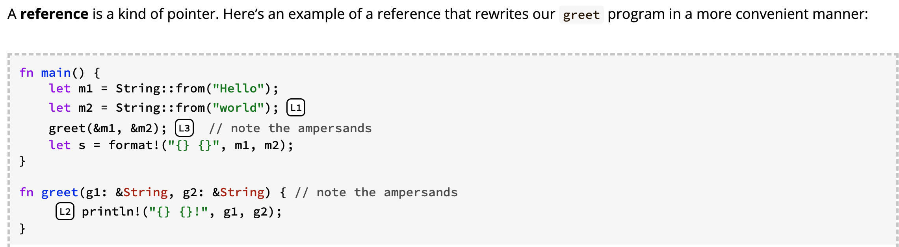

References are **non-owning pointers**, because they do not own the data they point to

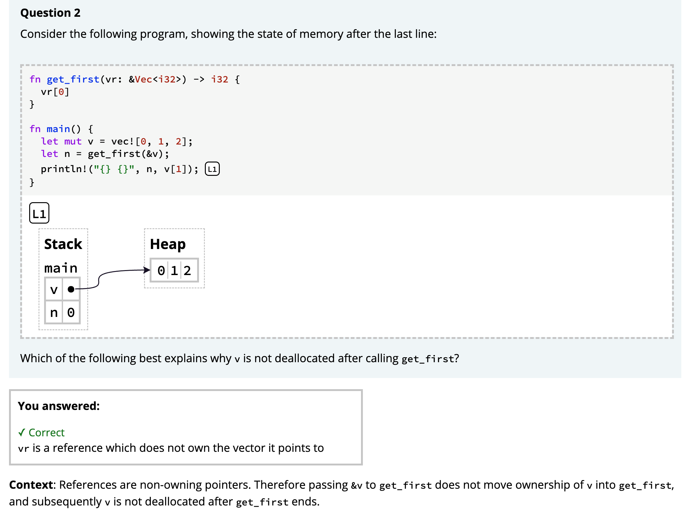

Arrays have a fixed length; vectors have a variable length by storing their elements in the heap. 

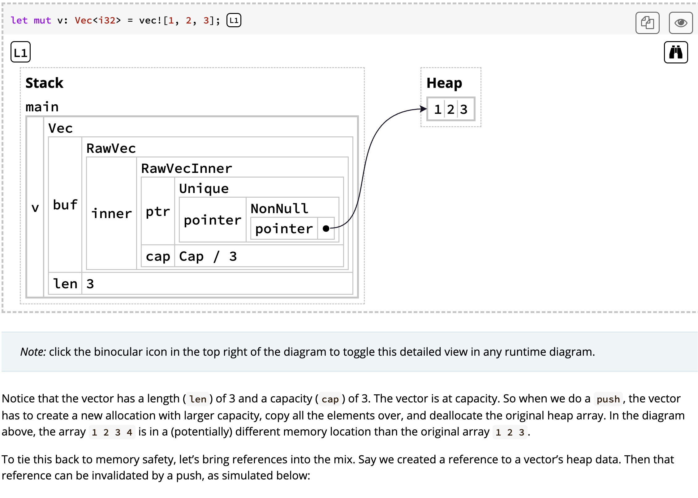

Pointer safety principle: data should never be aliased and mutated at the same time. 

References provide the ability to read and write data without consuming ownership of it. References are created with borrows (`&` and `&mut`) and used with dereferences (`*`), often implicitly.

- All variables can read, own, and (optionally) write their data.
- Creating a reference will transfer permissions from the borrowed place to the reference.
- Permissions are returned once the reference’s lifetime has ended.
- Data must outlive all references that point to it.

⚠️ **Chapter 4 - Understanding Ownership**

That “transfer of ownership” is one of the core concepts in **Rust’s ownership system**, which is unique compared to most other mainstream languages.

Here’s the big picture:

---

### 1. Ownership

- Every value in Rust has a **single owner** (the variable that holds it).
- When ownership moves (like passing `rect1` into `area(rect1)`), the original variable can’t be used anymore.

---

### 2. Borrowing

- Instead of moving ownership, you can **borrow** with `&` (immutable borrow) or `&mut` (mutable borrow).
- Borrowing lets a function temporarily use a value without taking it away.

Example:

```rust
fn area(r: &Rectangle) -> u32 { r.width * r.height }

let rect1 = Rectangle { width: 30, height: 50 };
let a = area(&rect1);   // borrow instead of move
println!("{}", rect1.width); // still valid
```

---

### 3. Why?

Rust enforces these rules at compile time to:

- Prevent **dangling references** (using memory after it’s freed).
- Avoid **data races** in concurrent code.
- Make **memory management automatic** without a garbage collector.

---

So yes — this whole “ownership moves vs borrowing” is pure Rust.

In C++ you’d need to think about copy/move constructors and lifetimes manually; in Python/Java everything is heap-allocated with automatic references. Rust’s model is different: **ownership is always explicit and checked at compile time.**

- Python: variables are **shared references**; memory is freed by the garbage collector when no references remain.
- Rust: variables are **owners**; memory is freed immediately when the owner goes out of scope, unless it’s borrowed.

Getters are useful because you can make the field private but the method public, and thus enable read-only access to that field as part of the type’s public API. 

Structs let you create custom types that are meaningful for your domain. By using structs, you can keep associated pieces of data connected to each other and name each piece to make your code clear. In `impl` blocks, you can define functions that are associated with your type, and methods are a kind of associated function that let you specify the behavior that instances of your structs have.

**Chapter 6** 

Rust does not have the null feature that many other languages have. Null is a value that means there is no value there. In languages with null, variables can always be in one of two states: null or not null. 

The problem with nulls, is when you try and use a null value as a not-null value. 

Use null as a: a value that is currently invalid or absent for some reason. 

Rust uses `Option<T>` as a value being present or absent. (`<T>` means that the `Some` variant of the `Option` enum can hold one piece of data of any type, and that each concrete type that gets used in place of `T` makes the overall `Option<T>` type a different type) 

```jsx
enum Option<T> {
	None,
	Some(T),
}
```

Eliminating the risk of incorrectly assuming a not-null value helps you to be more confident in your code. In order to have a value that can possibly be null, you must explicitly opt in by making the type of that value `Option<T>`. Then, when you use that value, you are required to explicitly handle the case when the value is null. Everywhere that a value has a type that isn’t an `Option<T>`, you *can* safely assume that the value isn’t null. This was a deliberate design decision for Rust to limit null’s pervasiveness and increase the safety of Rust code.

Rust does not have nullptr so the `null` keyword does not exist. An `Option` type should be used to represent the possibility of an object being null. 

- **Packages**: A Cargo feature that lets you build, test, and share crates
- **Crates**: A tree of modules that produces a library or executable
- **Modules and use**: Let you control the organization, scope, and privacy of paths
- **Paths**: A way of naming an item, such as a struct, function, or module

Crates can come in two forms:

- binary crate which can be compiled and executed on a command line program or a server.
- library crate: library module that can be imported by other crates and used. They do not have a main function. “library crate == library”.

A package is a bundle of one or more crates that provides a set of functionality. A package contains a Cargo.toml that describes how to build those crates. Cargo is actually a package that contains the binary crate for the command line tool you’ve been using to build your code. The Cargo package also contains a library crate that the binary crate depend on. 

Package > crate > module 

- **Rust Package** → may contain multiple **Crates**.
- **Rust Crate** → contains one root file (`main.rs` or `lib.rs`) and many **Modules**.
- **Rust Module** → subdivisions of a crate (files/folders of code

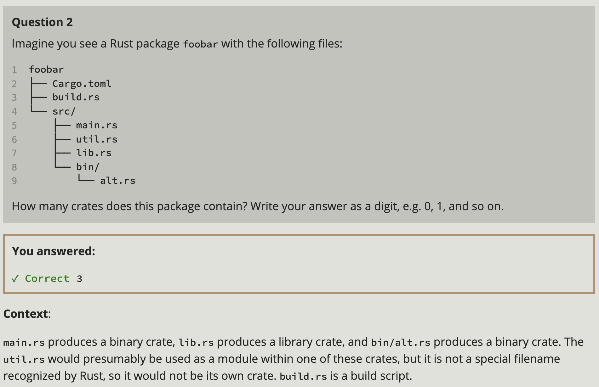

Chapter 7.2 

- **Crate root**: Compilation starts from the crate root (`src/lib.rs` for libraries, `src/main.rs` for binaries).
- **Declaring modules**: `mod name;` in the crate root tells the compiler to look for the module inline, in `src/name.rs`, or in `src/name/mod.rs`.
- **Submodules**: Declared in non-root files; their code is found inline, in `src/parent/sub.rs`, or `src/parent/sub/mod.rs`.
- **Paths**: Access items using full paths (e.g., `crate::garden::vegetables::Asparagus`).
- **Visibility**: Everything is private by default; use `pub mod` and `pub` to expose modules and items.
- **use keyword**: Brings items into scope as shortcuts (e.g., `use crate::garden::vegetables::Asparagus;` lets you just write `Asparagus`).

Modules have no effect on runtime, they are purely for compile-time organization. 

When defining methods, its best to use the absolute path. In Rust, all items (functions, methods, structs, enums, modules, and constants are private to parent modules by default). 

- Items in a parent module can’t use the private items inside child modules, but items in a child modules can use the items in their ancestor modules. This is because child modules wrap and hide their implementation details, but the child modules can see the context in which they’re defined.

 [The Rust API Guidelines](https://rust-lang.github.io/api-guidelines/).

The keyword you use at the start of an absolute path to an item in the current crate is : `crate` 

You can construct relative paths that begin in the parent module, rather than the current module or the crate root by using `super`. Using `super` is like using `..` syntax in a filesystem.


Object oriented programs are made up of objects. An object packages both data and procedures that operate on that data. The procedures are typically called methods or operations. 

Rust: Structs and enums have data and `impl`  blocks provide methods on structs and enums. Even though structs and enums with methods aren’t called object, they provide the same functionality according to the Gang of Four’s definition of objects. 

Encapsulation: implementation details of an object aren’t accessible to code using that object. Therefore the only way to interact with an object is through its public API; code using the object shouldn’t be able to reach into the object’s internals and change data or behavior directly. You can handle encapsulation by marking `impl`  as `pub = public or private` . 

If encapsulation is a required aspect for a language to be considered object oriented, then Rust meets that requirement. The option to use `pub` or not for different parts of code enables encapsulation of implementation details.

Inheritance: an object can inherit elements from another object’s definition thus gaining the parent object’s data and behavior without you having to define it again.  There is no way to define a struct that inherits the parent struct’s fields and method implementations without using a macro.

The main use of inheritance is:

- reuse code
- overrides; the child does things slightly different to the parent.

Polymorphism: you can substitute multiple objects for each other at runtime if they share certain characteristics. 

### [Polymorphism](https://rust-book.cs.brown.edu/ch18-01-what-is-oo.html#polymorphism)

To many people, polymorphism is synonymous with inheritance. But it’s actually a more general concept that refers to code that can work with data of multiple types. For inheritance, those types are generally subclasses.

Rust instead uses generics to abstract over different possible types and trait bounds to impose constraints on what those types must provide. This is sometimes called *bounded parametric polymorphism*.

Inheritance has recently fallen out of favor as a programming design solution in many programming languages because it’s often at risk of sharing more code than necessary. Subclasses shouldn’t always share all characteristics of their parent class but will do so with inheritance. This can make a program’s design less flexible. It also introduces the possibility of calling methods on subclasses that don’t make sense or that cause errors because the methods don’t apply to the subclass. In addition, some languages will only allow single inheritance (meaning a subclass can only inherit from one class), further restricting the flexibility of a program’s design.

Which of the following aspects of object-oriented programming does Rust implement?

- encapsulation with private data
- objects with methods.
- It does not do inheritance.

How to use External Packages in Rust. When you do `rand = "0.8.5"` to the `Cargo.toml` file. This tells Cargo to download the `rand` package and any dependencies from [`crates.io`](http://crates.io) and make `rand` available to our project. 

- Rust was designed specifically to *preserve the performance and control of C/C++* but **eliminate whole classes of bugs at compile time** (dangling references, use-after-free, data races).
- That’s why people call Rust “a systems programming language for the 21st century.”

STRINGS 

Many of the same operations available with Vec<T> are available with String as well because String is actually implemented as a wrapper around a vector of bytes with some extra guarantees, restrictions, and capabilities. 

What is the difference between using `a + b` and `a.push_str(b)` to concatenate two strings?

- The + consumes ownership of `a` while `push_str` does not.
    
    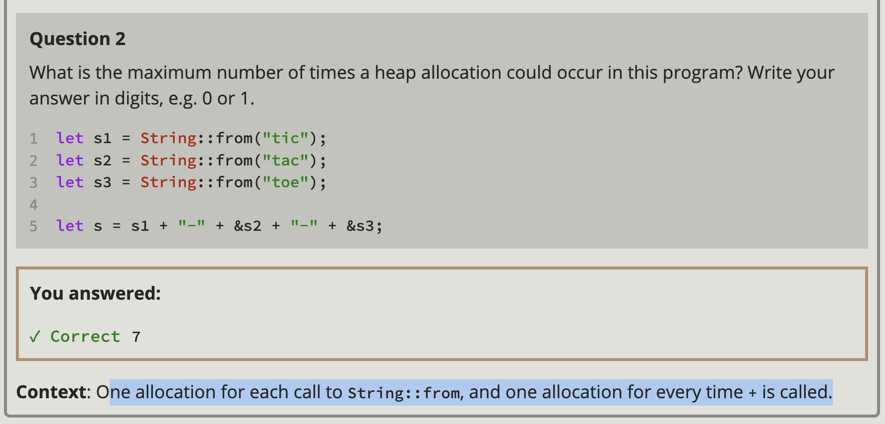
    

Rust does not support indexing for strings (e.g you cannot do `s1[0]` where `let s1 = String::from("hi")` . A string is a wrapper over `Vec<u8>`

A final reason Rust doesn’t allow us to index into a `String` to get a character is that indexing operations are expected to always take constant time (O(1)). But it isn’t possible to guarantee that performance with a `String`, because Rust would have to walk through the contents from the beginning to the index to determine how many valid characters there were.

Indexing into a string is often a bad idea because it’s not clear what the return type of the string-indexing operation should be: a byte value, a character, a grapheme cluster, or a string slice. If you really need to use indices to create string slices, therefore, Rust asks you to be more specific.

Indexing strings is ambiguous because strings represent several granularities of sequenced data. 

Which statement best describes the difference between the types of a string slice `&str` and a byte slice `&[u8]`?

- `&str` points to bytes that can always be interpreted as UTF-8, whereas `&[u8]` can be any byte sequence
- **Context**: `&str` is a promise that the byte sequence it points to will always be valid UTF-8. Therefore a programmer who wants to e.g. print out an `&str` never needs to check if it is valid, or worry about accidentally interpreting an invalid string

Rust has an `or_insert` method which return a mutable reference to a value in a hashmap if the key exists. Otherwise it inserts the new key. 

### [Hashing Functions](https://rust-book.cs.brown.edu/ch08-03-hash-maps.html#hashing-functions)

By default, `HashMap` uses a hashing function called *SipHash* that can provide resistance to denial-of-service (DoS) attacks involving hash tables[1](https://rust-book.cs.brown.edu/ch08-03-hash-maps.html#footnote-siphash). This is not the fastest hashing algorithm available, but the trade-off for better security that comes with the drop in performance is worth it. If you profile your code and find that the default hash function is too slow for your purposes, you can switch to another function by specifying a different hasher. A *hasher* is a type that implements the `BuildHasher` trait. We’ll talk about traits and how to implement them in [Chapter 10](https://rust-book.cs.brown.edu/ch10-02-traits.html). You don’t necessarily have to implement your own hasher from scratch; [crates.io](https://crates.io/) has libraries shared by other Rust users that provide hashers implementing many common hashing algorithms.


1. Given a list of integers, use a vector and return the median (when sorted, the value in the middle position) and mode (the value that occurs most often; a hash map will be helpful here) of the list.

```jsx
use std::collections::HashMap; 

pub fn create_vector() -> Vec<i32>{
    let mut vec = Vec::new(); 
    for i in 1..=10{
        vec.push(i)
    }
    vec 
}

pub fn get_median(vec: &Vec<i32>) -> f64{
    let mut sorted = vec.clone(); 
    sorted.sort(); 
    let len = sorted.len(); 
    if len % 2 == 0{
        (sorted[len / 2 - 1] as f64 + sorted[len / 2] as f64 ) / 2.0 
    }else{
        sorted[len/2] as f64 
    }
}

pub fn get_mode(vec: &Vec<i32>) -> i32{
    let mut occurrences = HashMap::new(); 
    for &value in vec{
        *occurrences.entry(value).or_insert(0) += 1;
    }
    *occurrences
        .iter()
        .max_by_key(|entry| entry.1)
        .map(|(key, _)| key)
        .unwrap()
}

fn main() {
    let vector = create_vector();
    println!("Vector : {:?}", vector); 
    println!("Median : {}", get_median(&vector)); 
    println!("Mode : {}", get_mode(&vector)); 
}
```

1. Convert strings to pig latin. The first consonant of each word is moved to the end of the word and *ay* is added, so *first* becomes *irst-fay*. Words that start with a vowel have *hay* added to the end instead (*apple* becomes *apple-hay*). Keep in mind the details about UTF-8 encoding!

```jsx
pub fn create_string() -> String{
    let string_ = String::from("first"); 
    string_ 
}

pub fn pig_latin_string(mut string_: String) -> String{
    let first_char = string_.chars().next().unwrap(); 
    if "aeiouy".contains(first_char){
        string_.push_str("-hay");
    }else{
        let trailing_character = format!("-{}ay", first_char); 
        string_ = string_.chars().skip(1).collect::<String>() + &trailing_character; 
    }
    string_ 
}

fn main() {
    let string_ = create_string();
    println!("Original : {}", string_);  
    println!("Pig latin : {}", pig_latin_string(string_))
}
```

1. Using a hash map and vectors, create a text interface to allow a user to add employee names to a department in a company; for example, “Add Sally to Engineering” or “Add Amir to Sales.” Then let the user retrieve a list of all people in a department or all people in the company by department, sorted alphabetically.

```jsx
use std::collections::HashMap; 
use std::io; 
use std::io::Write;

pub fn add(employee_directory: &mut HashMap<String, Vec<String>>){
    print!("Please input the employee's name: "); 
    io::stdout().flush().expect("flush failed"); 
    let mut employee_name = String::new();
    io::stdin()
        .read_line(&mut employee_name)
        .expect("Failed to read employee name");
    let employee_name = employee_name.trim().to_string(); 

    print!("Please input the employee's department: "); 
    io::stdout().flush().expect("flush failed"); 
    let mut employee_department = String::new(); 
    io::stdin()
        .read_line(&mut employee_department)
        .expect("Failed to read employee department");
    let employee_department = employee_department.trim().to_string(); 

    employee_directory.entry(employee_department.clone()).or_default().push(employee_name.clone()); 

    println!("Employee '{}' has been added to '{}'", employee_name, employee_department);
}

pub fn get(employee_directory: &HashMap<String, Vec<String>>){
    print!("Enter department name to view employees: "); 
    io::stdout().flush().expect("flush failed"); 

    let mut department_name = String::new(); 
    io::stdin().read_line(&mut department_name).expect("Failed to read department name"); 
    let department_name = department_name.trim(); 

    match employee_directory.get(department_name) {
        Some(employees) => {
            let mut sorted_employees = employees.clone();
            sorted_employees.sort();
            println!("\nEmployees in '{}':", department_name);
            for employee in sorted_employees {
                println!("- {}", employee);
            }
            println!();
        }
        None => {
            println!(
                "No employees found in department '{}'.",
                department_name
            );
        }
    }
}

fn main() {
    let mut employee_directory: HashMap<String, Vec<String>>= HashMap::new(); 
    
    loop{
        eprint!("Command (add/get/break): ");
        io::stderr().flush().expect("flush failed");

        let mut user_command = String::new(); 
        io::stdin().read_line(&mut user_command).expect("Failed to read line"); 
        let trimmed_command = user_command.trim(); 

        match trimmed_command{
            "add" => add(&mut employee_directory),
            "get" => get(&employee_directory),
            "break" | "exit" | "quit" => {
                println!("Exiting program."); 
                break; 
            }
            _ => println!("Unknown command '{}'", trimmed_command),
        }

    }
}
```

Rust does not have the concept of `try and except` . Instead it has the type `Result<T,E>`  for recoverable errors and the `panic!` macro that stops execution when the program encounters an unrecognizable error. 

In C, accessing an array element outside the bounds of the data structure results in **undefined behavior**. The program might attempt to read whatever happens to be stored at that memory address, even though it doesn’t belong to the array. This is known as a **buffer overread** and can introduce serious security vulnerabilities. If an attacker can control the out-of-range index, they may be able to read sensitive data that should otherwise be inaccessible.

When to use `panic!` vs when not to use `panic!` : When code panics there is no way to recover. Returning the default `Result` is a good default choice when you’re defining a function that might fail. 

The `panic!` is often appropriate if you’re calling external code that is out of your control and it returns an invalid state that you have no way of fixing. 

When failure is appropriate, its more appropriate to return a `Result` than to make a `panic!` call (e.g a parser being given a malformed data or an HTTP request returning a status that indicates you have hit a rate limit). 

**Functions have contracts: their behavior is only guaranteed if the inputs meet particular requirements. Panicking when the contract is violated makes sense a contract violation always indicates a caller-side bug, and its not a kind of error you want the calling code to have to explicitly handle.** 

The static typing of rust helps with error checking. Your methods do not have to be super verbose because the compiler will throw an error if a calling method tries to pass in None into a method that expects values. 

```jsx
Designing a library for writing command-line interfaces.
A function to parse command-line flags provided by a user. 

fn parse_flag_v1(flag: &str) -> Result<String, String> {
  match flag.strip_prefix("--") {
    Some(no_dash) => Ok(no_dash.to_string()),
    None => Err(format!("Invalid flag {flag}"))
  }
}

This implementation is ideal because its a recoverable error (the 
Result). If a CLI user passes an incorrectly formatted flag,
than the CLI library might want to provide additional help
like displaying the possible set of flags. 
A panic would force the application to only show the panic message
and then kill the program. 

--- When to panic vs. return Result

Return Result for expected, 
user-caused errors (bad flags, missing args, invalid values).

Panic only for true programmer 
bugs or impossible states (invariants violated), 
not for routine CLI misuse.
```

The `panic!` macro signals that your program is in a state it can’t handle and lets you tell the process to stop instead of trying to proceed with invalid or incorrect values. The `Result` enum uses Rust’s type system to indicate that operations might fail in a way that your code could recover from.

Using generics won’t make your program run any slower than it would with concrete types. Rust accomplishes this by performing monomorphization of the code using generics at compile time. Monomorphization is the process of turning generic code into specific code by filling in the concrete types that are used when compiled. 

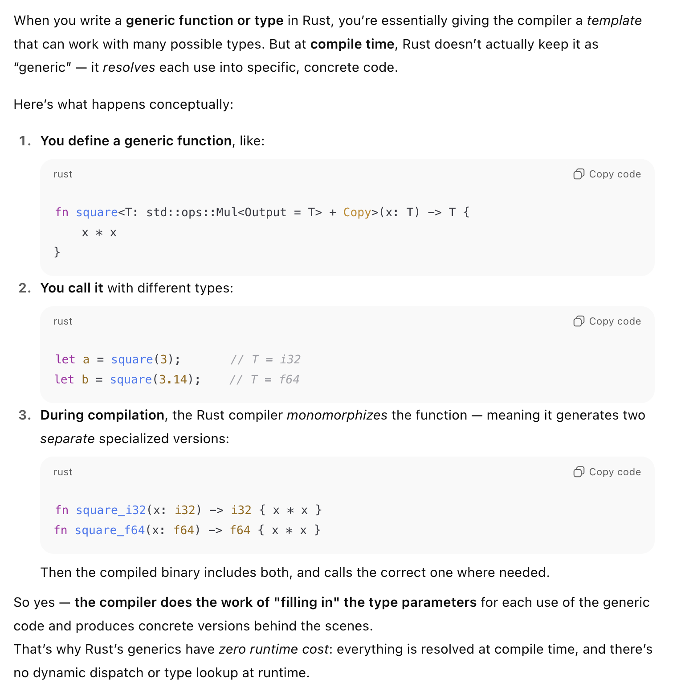

monomorphization can increase the binary size a bit, when generics are used very broadly with many type parameters. 

The tradeoff is **speed**:

- Each copy is fully specialized → no runtime type checks or dynamic dispatch.
- The compiler can **inline** and **optimize** each version perfectly.
- The result is often **as fast as handwritten type-specific code**.

So you’re trading a little more binary size for **maximum runtime efficiency.**

A trait defines the functionality a particular type has and can share with other types. We can use traits to define a shared behavior in an abstract way. We can use trait bounds to specify that a generic type can be any type that has certain behavior. 

**Traits are similar to a feature often called interfaces in other languages, although with some differences.**

Rust has this concept of lifelines which is not present in other languages. The main aim of lifetimes is to prevent dangling references, which causes a program to reference data other than the data it’s intended to reference. 

Rust has this “borrow checker” which ensures data outlives its references. This borrow checker compares scopes to determine whether all borrows are valid. 

Lifetimes are supposed to prevent references to an object after its memory has been freed. Lifetimes help identify how long an object is “live” and whether references to that object outlive the object itself.

Lifetimes on function or method parameters are called *input lifetimes*, and lifetimes on return values are called *output lifetimes*.

The `static` lifetime is a reference that can live for the entire duration of the program. The object is stored directly in the program’s binary, which is always available. 

If a reference has a lifetime `static` then this means: the data under the reference is never deallocated. 

Tests run in parallel. Ideally you should not write tests that depend on each other or on any shared state including a shared environment, such as the current working directory or environment variables. 

Unit tests are small and more focused, testing only one module in one isolation at a time and can test private interfaces. Integration tests are entirely external to your library and use your ocde in the same way any other external code would using only the public interface and potentially exercising multiple modules per test. 

The purpose of units tests is to test each unit of code in isolation from the rest of the code to quickly pinpoint where code is and isn’t working as expected. 

The `#[cfg(test)]` annotation on the `tests` module tells rust to compile and run the test code only when you run `cargo test` . This saves compile time whexn you only want to build the libraryand saves space in the resultant compiled artifact because the tests are not included. You’ll see that because integration tests go in a different directory, they don’t need the `#[cfg(test)]` annotation. 

The `cfg == configuration` . 

In rust, integration tests are entirely external to your library. They use your library in the same way any other code would, which means they can only call functions that are part of your library’s public API. Their purpose is to test whether many parts of your library work together correctly. Units of code that work correctly on their code may not work when integrated with other components. 

Functional languages: Programming in a functional style often includes using functions as values by passing them in arguments, returning them from other functions, assigning them to variables for later execution, and so forth. 

- Closures: a function-like construct you can store in a variable.
    - anonymous functions that can capture variables from the environment.
    - capture modes: borrow immutably `Fn` , borrow mutably `FnMut` , move ownership `FnOnce`
- Iterators: a way of processing a series of elements.

[https://rust-lang.org/governance/](https://rust-lang.org/governance/) 

Personal project:
- Download DeepSeek’s weight. Run them locally using huggingface transforms, vLLM, LM studio or llama.cpp.

- Open your network monitoring tools. Watch as exactly zero packets are sent. [https://erichartford.com/the-demonization-of-deepseek](https://erichartford.com/the-demonization-of-deepseek)

Rust vs ada: https://github.com/johnperry-math/AoC2023/blob/master/More_Detailed_Comparison.md 

Rust’s design follows the principle of *zero-cost abstractions*: code written with higher-level constructs compiles down to essentially the same machine code you’d get if you wrote it manually in a lower-level style. Iterators are a prime example — they provide expressive, high-level syntax while adding no extra runtime overhead.

Bjarne Stroustrup: In general, C++ implementations obey the zero-overhead principle: What you don’t use, you don’t pay for. And further: What you do use, you couldn’t hand code any better.

Closures and iterators are Rust features inspired by functional programming language ideas. They contribute to Rust’s capability to clearly express high-level ideas at low-level performance. The implementations of closures and iterators are such that runtime performance is not affected. This is part of Rust’s goal to strive to provide zero-cost abstractions.

The default profile for `cargo build` is dev. You should add `--release` if you want the `release` profile for longer compile times but faster code execution. 

Comments: 

- `//!` is appropriate for module-level documentation, while `///` is for documenting individual items like functions.

✅ Chapter 12 

The organizational problem of allocating responsibility for multiple tasks to the `main` function is common to many binary projects. As a result, the Rust community has developed guidelines for splitting the separate concerns of a binary program when `main` starts getting large. This process has the following steps:

- Split your program into a *main.rs* file and a *lib.rs* file and move your program’s logic to *lib.rs*.
- As long as your command line parsing logic is small, it can remain in *main.rs*.
- When the command line parsing logic starts getting complicated, extract it from *main.rs* and move it to *lib.rs*.

The responsibilities that remain in the `main` function after this process should be limited to the following:

- Calling the command line parsing logic with the argument values
- Setting up any other configuration
- Calling a `run` function in *lib.rs*
- Handling the error if `run` returns an error

This pattern is about separating concerns: *main.rs* handles running the program and *lib.rs* handles all the logic of the task at hand. Because you can’t test the `main` function directly, this structure lets you test all of your program’s logic by moving it into functions in *lib.rs*. The code that remains in *main.rs* will be small enough to verify its correctness by reading it. Let’s rework our program by following this process.

Some Rustaceans try to avoid using `clone()` to fix ownership problems because of its runtime cost. 

✅ Chapter 13, Chapter 14 

**✅** Chapter 15 

References & borrow the value that they point to. 

Smart pointers are data structures that act like a pointer but also have an additional metadata and capabilities. Smart pointers own the data they point to. The `String and Vec<T>` are both smart pointers. 

The interior mutability pattern is where an immutable type exposes an API for mutating an interior value. 

The `Box<T>` is a common smart pointer. This allows you to store data on the heap instead of the stack. You will use a `Box<T`  when: 

- When you have a type whose size can’t be known at compile time and you want to use a value of that type in a context that requires an exact size
- When you have a large amount of data and you want to transfer ownership but ensure the data won’t be copied when you do so
- When you want to own a value and you care only that it’s a type that implements a particular trait rather than being of a specific type

Storing large amounts of data on the heap in a box can be more performant that on the stack. 

✅ Chapter 16 

Concurrent programming is when different parts of a program execute independently.

Parallel programming is which different parts of a program execute at the same time. This is more important as more computers are taking advantage of multiple processors. The Rust team discovered that the ownership and type systems are a powerful set of tools to help manage memory safety and concurrency problems. **Fearless concurrency allows you to write code that is free of subtle bugs and is easy to refactor without introducing new bugs.** 

Erlang has an elegant functionality for message-passing concurrency but has only obscure ways to share state between threads. Lower level languages are expected to provide the best solution with the best performance in any given situation and have fewer abstractions over the hardware. 

In most operating systems, an executed program’s code is run in a process, and the operating system will manage multiple processes at once. Within a program, you can also have independent arts that run simultaneously. The features that run these independent parts are called threads. 

Splitting the computation in your program into multiple threads to run multiple tasks at the same time can improve performance, but it also adds complexity. Because threads can run simultaneously, there’s no inherent guarantee about the order in which parts of your code on different threads will run. This can lead to problems, such as:

- Race conditions, in which threads are accessing data or resources in an inconsistent order
- Deadlocks, in which two threads are waiting for each other, preventing both threads from continuing
- Bugs that happen only in certain situations and are hard to reproduce and fix reliably

This is a cool exercise that shows the operating system toggling between different threads. 

All spawned threads are shut down regardless if they are finished running. 

The output may be different each time. 

```jsx
use std::thread;
use std::time::Duration;

fn main() {
    thread::spawn(|| {
        for i in 1..10 {
            println!("hi number {i} from the spawned thread!");
            thread::sleep(Duration::from_millis(1));
        }
    });

    for i in 1..5 {
        println!("hi number {i} from the main thread!");
        thread::sleep(Duration::from_millis(1));
    }
}
```

From GO: “do not communicate by sharing memory; instead share memory by communicating”. To accomplish message-sending concurrency, rust’s standard library provides an implementation of channels. A channel is a general programming concept by which data is sent from one thread to another. 

You can use channels for “chat systems, or a system where many threads perform parts of a calculation and send the parts to one thread that aggregates the results”. 

**mpsc: multiple producer, single consumer. A single channel can have multiple sending ends that produce values but only one receiving end that consumes those values. Imagine multiple streams flowing together into one big river, everything sent down any of the streams will end up in one river at the end.** 

Shared memory concurrency is like multiple ownership: multiple threads can access the same memory location at the same time. Multiple ownership can add complexity because these different owners need managing. 

A mutex is a mutual exclusion which allows one thread to access some data at any given time. To access the data in a mutex, a thread must first signal that it wants access by asking to acquire the mutex’s lock. The lock is a data structure that is part of the mutex that keeps track of who currently has exclusive access to the data. The mutex is described as guarding the data it holds via the locking system. 

Mutexes have a reputation for being difficult to use because you have to remember two rules:

- You must attempt to acquire the lock before using the data.
- When you’re done with the data that the mutex guards, you must unlock the data so that other threads can acquire the lock. (e.g analogy a panel of speakers and only 1 microphone is provided).

Rust has a strong type system and ownership rules, so you can’t get locking and unlocking wrong. 

**✅ Chapter 17** 

Many operations we ask the computer to do can take a while to finish. It would be nice if we could do something while we are waiting for those long-running processes to complete. Modern computers offer two techniques for working on more than one operation at a time: parallelism and concurrency. Once we start writing programs that involve parallel or concurrent operations, we encounter new challenges inherent to asynchronous programming, where operations may not finish sequentially in the order they were started. 

Example scenario: If you were exporting a video. Your computer will use CPU and GPU power. If you only had 1 CPU core, your OS could not do anything else until this video uploaded completed : export synchronously. This is an example of a CPU bound or compute-bound operation. It’s limited by the computer’s potential data processing speed within the CPU or GPU, and how much of that speed it can dedicate to that operation. 

If you are downloading a video from an external server. The speed of the download is contigent on the IO speed. Therefore this is a IO-bound operation because its limited by the speed of the computer’s input and output; it can only go as fast as teh data can be sent across the network. 

The OS invisible interrupt provides a form of concurrency. The OS interrupts one program to let other programs get work done. 

When an individual works on several different tasks before any of them complete, this is concurrency. 

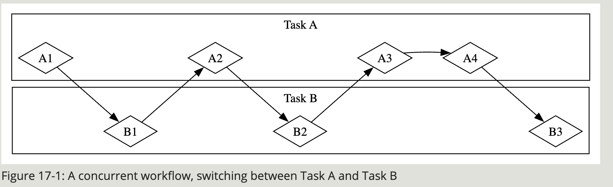

When the team splits up a group of tasks by having each member take one task and work on it alone, this is parallelism. Each person on the team can make progress at the same exact time

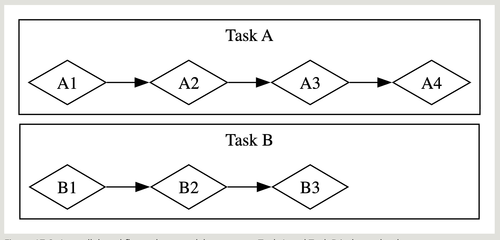

Most of the time workflows are going to look like this tho:

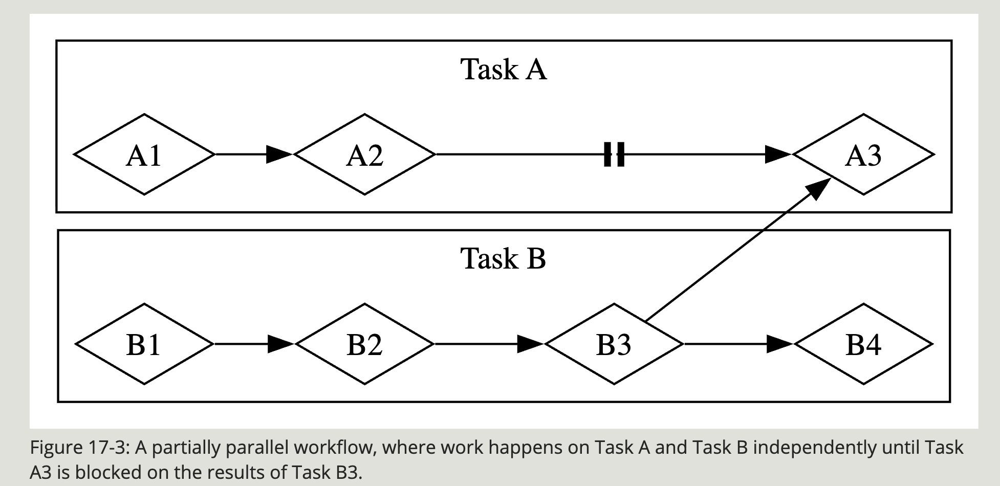

*The same basic dynamics come into play with software and hardware. On a machine with a single CPU core, the CPU can perform only one operation at a time, but it can still work concurrently. Using tools such as threads, processes, and async, the computer can pause one activity and switch to others before eventually cycling back to that first activity again. On a machine with multiple CPU cores, it can also do work in parallel. One core can be performing one task while another core performs a completely unrelated one, and those operations actually happen at the same time.*

*When working with async in Rust, we’re always dealing with concurrency. Depending on the hardware, the operating system, and the async runtime we are using (more on async runtimes shortly), that concurrency may also use parallelism under the hood.*

 A task is similar to a thread, but instead of being managed by the operating system, it’s managed by library-level code: the runtime.

Tasks act as a boundary for sets of *asynchronous* operations; concurrency is possible both *between* and *within* tasks, because a task can switch between futures in its body. Finally, futures are Rust’s most granular unit of concurrency, and each future may represent a tree of other futures. The runtime—specifically, its executor—manages tasks, and tasks manage futures. In that regard, tasks are similar to lightweight, runtime-managed threads with added capabilities that come from being managed by a runtime instead of by the operating system.

- **If the work is *very parallelizable*, such as processing a bunch of data where each part can be processed separately, threads are a better choice.**
- **If the work is *very concurrent*, such as handling messages from a bunch of different sources that may come in at different intervals or different rates, async is a better choice.**

This means that async can be useful even for compute-bound tasks, depending on what else your program is doing, because it provides a useful tool for structuring the relationships between different parts of the program. This is a form of *cooperative multitasking*, where each future has the power to determine when it hands over control via await points. Each future therefore also has the responsibility to avoid blocking for too long. In some Rust-based embedded operating systems, this is the *only* kind of multitasking!

✅ Chapter 18

✅ Chapter 19 

The difference between a refutable and an irrefutable pattern: Refutable patterns do not match some values of type T, while irrefutable patterns match all values of type T. 

```jsx
Consider the following program: let x: &[(i32, i32)] = &[(0, 1)]; 
Which of the following are refutable patterns for x? 
A. &[..] 
B. &[(x, y), ..] 
C. _ 
D. &[(x, y)]

A. &[..] — irrefutable: matches any slice of any length.
B. &[(x, y), ..] — refutable: fails on empty slices.
C. _ — irrefutable: always matches.
D. &[(x, y)] — refutable: only matches slices of length exactly 1.
```

Rust will warn you about unused variables. Therefore to workaroud this you can add a leading `_` to the variable name (e.g `_x` ). 

✅ Chapter 20

Rust has a second language that does not enforce memory guarantees; its called unsafe rust. The regular rust implements static analysis which is conservative. The compiler will be cautious and reject programs if it feels unsafe, even if the code is ok. If you use unsafe rust, you are essentially saying “trust me, I know what I’m doing”. What are the implications? A null pointer dereferencing. 

Rust has an unsafe alter ego because the computer hardware may be unsafe. If Rust was super strict, than you may not be able to do certain tasks on lower level systems (e.g directly interacting with the operating system). 

To use `unsafe` rust, use the `unsafe` keyword. The unsafe superpowers are : 

- dereference a raw pointer
- call an unsafe function or method
- access or modify a mutable static variable
- implement an unsafe trait
- access fields of a union

Its up to the programmer to ensure that the methods in the `unsafe` block work. 

To isolate unsafe code as much as possible, its best to enclose such code within a safe abstraction. 

**Continue Dereferencing A Raw Pointer** 

Rust does allow global variables, referred to as static variables, but they can introduce serious issues when accessed mutably from multiple threads. If two threads attempt to modify the same global state concurrently, a data race can occur. For this reason, Rust treats mutable static variables as unsafe.

When working with unsafe code, you can use Miri, a Rust tool that detects undefined behavior at runtime. Miri executes your program or test suite and reports violations of Rust’s safety rules as they occur.

Within an unsafe block, you are permitted to perform operations such as dereferencing raw pointers and calling functions marked as unsafe.