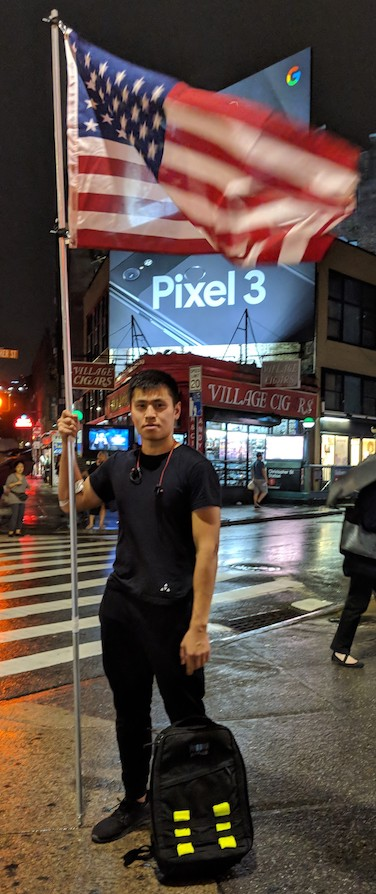
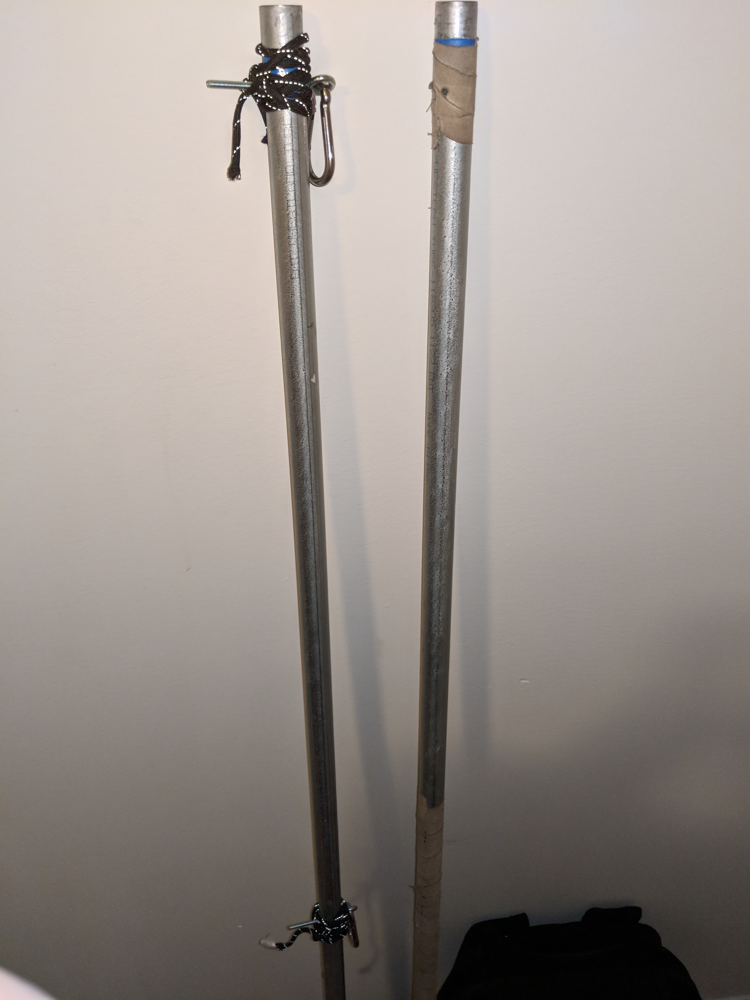
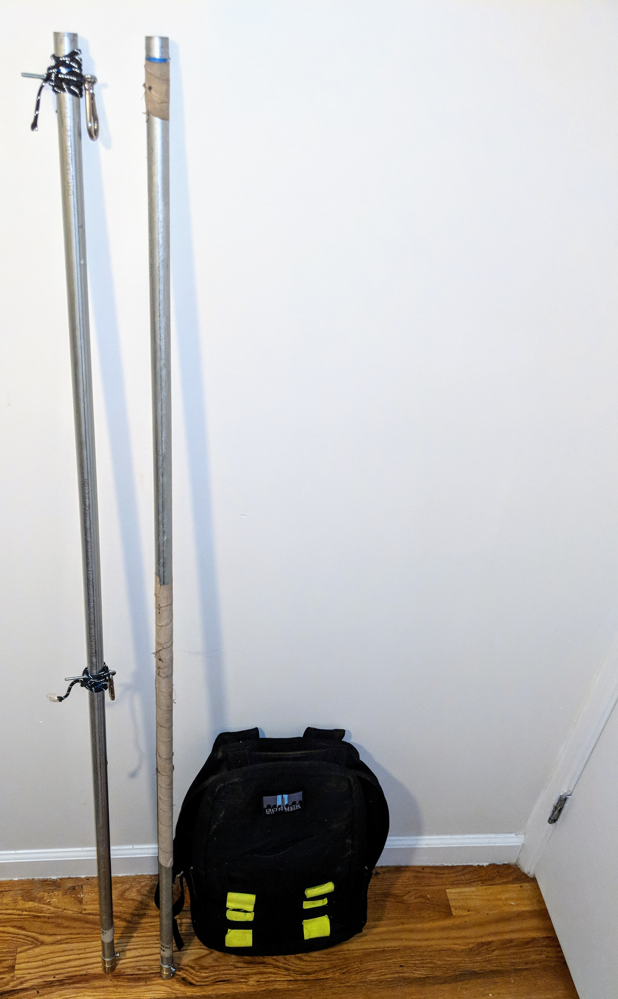
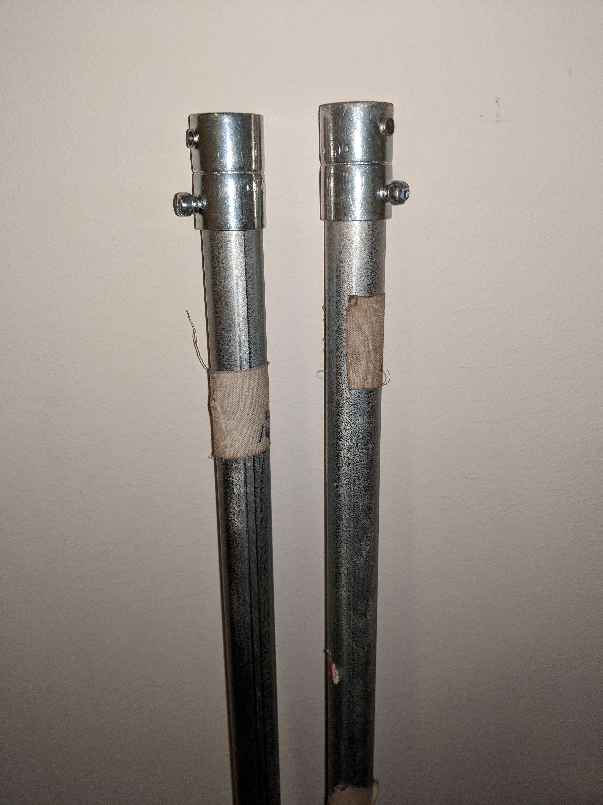
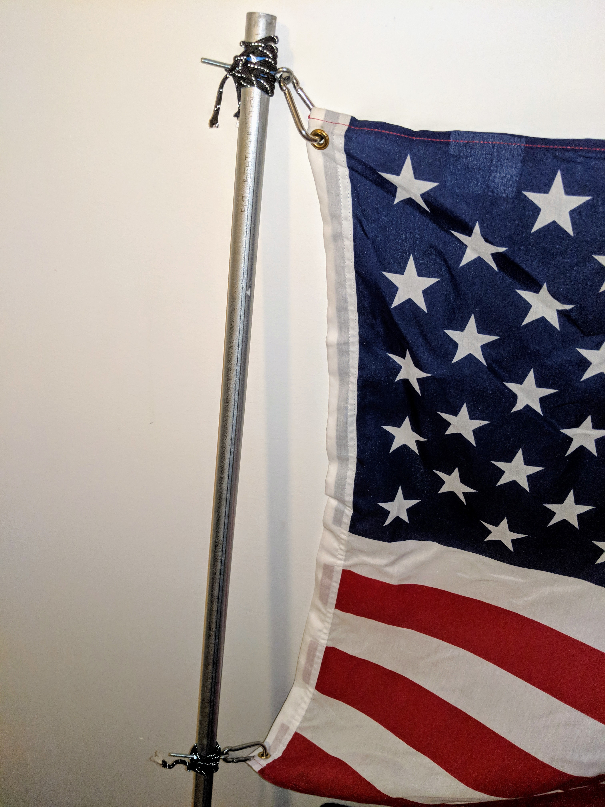

 #GoRuck Flag.

This American flag was designed and built by Haitai Ng for GoRuck Tough NYC 10/12/18.
This flag stands at 10ft x 3/4in, however the height can be re-adjusted to 5ft x 3/4in
or extended to greater heights. Constructed using EMT Steel conduit, this flag is strong
and lightweight. EMT conduit is one of the lightest form of steel conduit and it is
a great conductor for electrical current so you can use these rods for other projects.

 ####List of Materials ####
- 3ft. x 5ft. American Flag
- 1/4in. x 2-3/8in. Stainless Steel Spring Link
- 3/4in. x 5ft Electrical Metallic Tubing (EMT) Steel
- 3/4in. Electric Metallic Tube (EMT) Set Screw (5-pack)
- 3/16in. x 3in Zinc-Plated Steel Eye Bolts with Nuts (2-pack)
- 3/16in Milwaukee Thunderbolt Cobalt Drill Bit
- (Optional): Medical Tape

Estimated Cost
- 1 x American Flag: $19.92
- 2 x Stainless Steel Spring Lake: $9.88 ($4.94 each)
- 2 X (3/4in. x 5ft Electrical Metallic Tubing (EMT) Steel): $8.40 ($4.20 each)
- 1 x (3/4in. Electric Metallic Tube (EMT) Set Screw (5-pack)): $2.50
- 1 x (3/16in. x 3in Zinc-Plated Steel Eye Bolts with Nuts (2-pack)): $1.18
- 1 x (3/16in. Milwaukee Thunderbolt Cobalt Drill Bit: $4.27
- Optional: Medical Tape: $2.70
- Total: $48.85+

Tools for Assembly
-Drill
-Measuring Tape 
-Phillips screwdriver 

Assembly
1.) Drill four holes in one of the EMT conduit pipes (2 holes in the top,
2 holes below it). The 2 holes at the top and bottom must align with each 
other such that the Steel eye bolts can pierce completely thru the EMT conduit 
and you can install the washer on the opposite end. There should be a 
34.8inch+ distance (max limit is 3ft) between the top 2 holes and the bottom 2 holes.

2.) Insert the Steel eye bolts and washer. 

3.) Attach the Stainless Steel Spring lake to top eye bolt and bottom eye bolt. 
4.) Attach the Electric Metallic Set Screw to the opposite side of the top. This will
serve as the connector to additional EMT conduit pipes. I designed this flag
with feasibility and the ability to easily extend and reduce the length of the pole.
If you want to make the flag taller, add EMT conduit and attach more Electrical Metallic screws.

4.) Attach the flag. 

5.) Optional: Add medical tape the flag, and bungie cable. These are for cosmetic appeal. 

Substitutions and Tips
-I designed this flag such that the length can be easily extended or reduced. To 
add length, attach EMT conduit pipes and use the Electric Metallic Set screws. 
-I add an Electric Metallic set screw to the bottom of the EMT conduit pipe, and wrap it with 
medical tape, so when I bump into shit I have a lower probability of scratching
or denting it. 
-The Stainless Steel Spring Lake can be replaced by any standard carabiner that can
fit thru the holes of the flag.
-If you are unable to find a drill & drill bit to pierce the EMT conduit pipe,
you can try purchasing bungie cable and wrap the flag around the EMT
conduit pipe. When I originally built this I had less than 24 hours to find
a drill. This was my back up plan if I was unable to find a drill.

*For those living in lower Manhattan, I visited and or contacted multiple
hardware, lumber, plumbing, and Electrical stores in search of someone who would
do a quick  drill job. If you do not have a drill you have two options: rent a
drill from Home Depot, or find a handyman that will do this service for a small
service fee.

Best of luck,
Haitai Ng 

